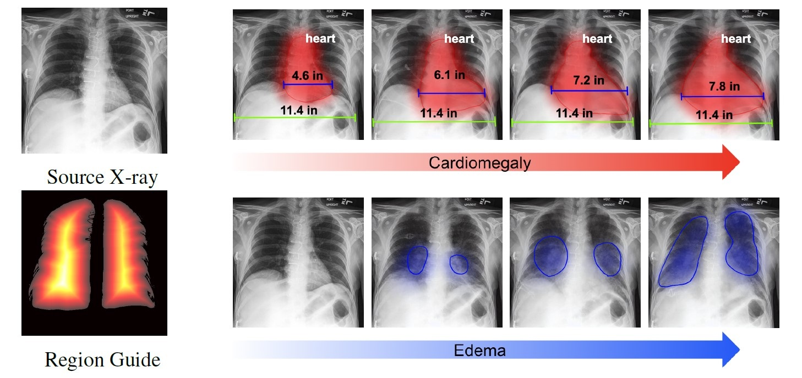

# PIE: Simulating Disease Progression via Progressive Image Editing    

[[Project Homepage](https://www.irohxucao.com/PIE/)]    |    [[Preprint](https://arxiv.org/abs/2309.11745)]     |    [[HuggingFace](https://huggingface.co/papers/2309.11745)]

Official Implementation of "Simulating Disease Progression via Progressive Image Editing".   




Disease progression simulation is a crucial area of research that has significant implications for clinical diagnosis, prognosis, and treatment. One major challenge in this field is the lack of continuous medical imaging monitoring of individual patients over time. To address this issue, we develop a novel framework termed Progressive Image Editing (PIE) that enables controlled manipulation of disease-related image features, facilitating precise and realistic disease progression simulation. Specifically, we leverage recent advancements in text-to-image generative models to simulate disease progression accurately and personalize it for each patient.    

To our best knowledge, PIE is the first of its kind to generate disease progression images meeting real-world standards. It is a promising tool for medical research and clinical practice, potentially allowing healthcare providers to model disease trajectories over time, predict future treatment responses, and improve patient outcomes.     


## Requirements    

Install the newest PyTorch.      

```
conda install pytorch torchvision torchaudio pytorch-cuda=11.8 -c pytorch -c nvidia
```

```
pip install -r requirements.txt
```

## Inference    


### Sampling Script    

Try new pretrained weight from MIMIC-CXR dataset [here](https://huggingface.co/IrohXu/stable-diffusion-mimic-cxr-v0.1)

```
python run_pie.py \
    --pretrained_model_name_or_path="CompVis/stable-diffusion-v1-4" \
    --finetuned_path="path-to-finetune-stable-diffusion-checkpoint" \
    --image_path="./assets/example_inputs/health.jpg" \
    --mask_path="./assets/example_inputs/mask.png" \
    --prompt="clinical-reports-about-any-diseases" \
    --step=10 \
    --strength=0.5 \
    --guidance_scale=27.5 \
    --seed=42 \
    --resolution=512
```

## Reference      

```
@article{liang2023pie,
  title={PIE: Simulating Disease Progression via Progressive Image Editing},
  author={Liang, Kaizhao and Cao, Xu and Liao, Kuei-Da and Gao, Tianren and Ye, Wenqian and Chen, Zhengyu and Cao, Jianguo and Nama, Tejas and Sun, Jimeng},
  year={2023}
}
```

